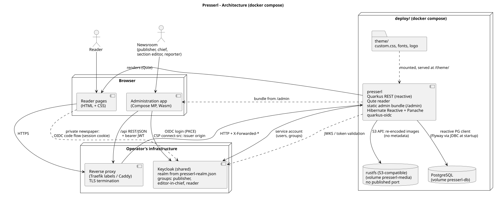

# Architecture



## Stack

| Part | Choice |
|---|---|
| Backend | Quarkus (current LTS), **Quarkus REST** (reactive), **Hibernate Reactive with Panache**, reactive PostgreSQL client, `quarkus-oidc` (bearer tokens for `/api`, code flow + session cookie for the reader), Flyway (runs at startup via an additional JDBC datasource — Flyway is not reactive), SmallRye OpenAPI, Keycloak Admin API client |
| Reader | Server-rendered HTML from **Qute** templates inside the backend — front page, sections, articles, print views; design tokens and fork theme |
| Administration app | **Compose Multiplatform** (Kotlin, Gradle), **Wasm web target** first, Android/iOS later from the same code base; OIDC auth code + PKCE via a small in-house browser flow behind an `AuthClient` interface (M0 spike: the KMP OIDC library's web flow is popup-only) |
| Database | **PostgreSQL** |
| Identity | **Keycloak provided by the operator** (usually shared): a dedicated realm imported from `deploy/keycloak/presserl-realm.json`; newspaper-wide roles as groups; public client `presserl-admin` (PKCE, audience `presserl-backend`, `groups` claim); confidential client `presserl-backend` whose **service account** manages users and groups (`manage-users`, `view-users`, `query-users`, `query-groups`) |
| Development | **Quarkus Dev Services** start PostgreSQL and Keycloak automatically — `quarkus dev` needs no configuration |
| CI/CD | UnterrainerInformatik workflows (`docker-build-workflow`, `deploy-workflow`, `bump-semver-workflow`); the admin Wasm bundle is built with Gradle and packaged into the backend image. CI builds and ships images only (bump → image build → staging dispatch on push to `master`); it runs no tests — the backend (`./mvnw verify`) and admin (`./gradlew check`) suites run locally before every push |
| Operations | docker compose: `presserl` (API + reader + static admin bundle) and `postgres` only. The TLS-terminating reverse proxy (Traefik via labels, or Caddy) and Keycloak are the operator's; `deploy/INSTALL.md` shows how to attach them |

Java toolchain: JDK 21 (`maven.compiler.release=21`, Temurin 21 in the image; see `ai/memory/reference_machine_jdk.md` — Lombok constraints).

Why the split: the reader needs a real DOM for print (`@page`), CSS theming, accessibility, search engines and link sharing — plain HTML, no second frontend build. The administration app is one Compose code base for web, Android and iOS (store release and QR scanning later). Rejected: Vue + Capacitor (two paradigms once native features grow) and Compose for the reader (canvas rendering breaks print, theming and accessibility).

## Repository layout

```
presserl/                     # monorepo (upstream)
├── backend/                  # Quarkus (Maven): API + Qute reader
├── admin/                    # Compose Multiplatform (Gradle): administration app
├── deploy/                   # reference deployment and templates
│   ├── INSTALL.md            # step-by-step installation guide
│   ├── compose.yaml
│   ├── .env.example          # mandatory values only: hostname, DB password, OIDC issuer + secrets, first publisher
│   ├── keycloak/presserl-realm.json   # realm template for the operator's Keycloak (hostname placeholder)
│   └── theme/                # template; overrides the default reader theme
│       ├── custom.css
│       ├── logo.svg
│       └── fonts/
├── http/                     # .http files for the REST API
├── docs/
├── openspec/
└── ai/

../presserl-deployment/       # the real fork: name, .env, theme — nothing else
```

A fork copies the templates from `deploy/`, sets name, `.env` and theme, and runs the upstream container images. Updates are an image-tag bump. `../presserl-deployment` is maintained alongside this repository; changes to it are recorded in this repository's OpenSpec changes.

## Configuration

Four layers; the later one wins:

1. **Code default** — `application.properties` (Quarkus / SmallRye Config)
2. **Deployment** — environment variable in `deploy/.env` (`PRESSERL_NEWSPAPER_VISIBILITY=private` overrides `presserl.newspaper.visibility`)
3. **Newspaper** — setting changed in the administration app by a publisher (database)
4. **Section** — setting per section (database; kept for future per-section overrides)

The database layers store only overrides, never copies of defaults. The backend exposes the *effective* value.

| Key | Default | Alternatives | Layers |
|---|---|---|---|
| `presserl.newspaper.name` | `My Newspaper` (i18n) | any | deployment, newspaper |
| `presserl.newspaper.subtitle` | empty | any | deployment, newspaper |
| `presserl.newspaper.visibility` | `public` | `private` | deployment, newspaper |
| `presserl.retract.author-can-retract` | `true` | `false` | deployment, newspaper |
| `presserl.section.default` | `General` (i18n) | any | deployment |
| `presserl.editor.level` | `standard` | `starter`, `profi` | deployment, newspaper, per user |
| `presserl.reader.text-size` | `m` | `s`, `l`, `xl` | deployment, newspaper, per reader |
| `presserl.media.max-size` | `10M` | any | deployment |
| `presserl.theme.css` | built-in theme | `/theme/custom.css` | deployment |

Approval is not configured by keys but by roles and trust (see [roles-and-workflow.md](roles-and-workflow.md#approval-chain)).

Deployment-only values (no defaults, set in `.env`):

| Variable | Purpose |
|---|---|
| `PRESSERL_PUBLISHER_USERNAME` / `PRESSERL_PUBLISHER_PASSWORD` | **Bootstrap:** on first start, if no publisher exists, the backend creates this account in the `publisher` group; it holds all roles |
| `PRESSERL_HOSTNAME`, `PRESSERL_DB_PASSWORD` | public DNS name (proxy rule, realm redirect URIs); database password |
| `PRESSERL_OIDC_ISSUER`, `PRESSERL_OIDC_BACKEND_SECRET`, `PRESSERL_OIDC_READER_SECRET`, `PRESSERL_OIDC_ADMIN_CLIENT_ID` | the realm in the operator's Keycloak; secrets of `presserl-backend` and `presserl-reader` (`PRESSERL_OIDC_READER_CLIENT_ID` optional, default `presserl-reader`) |

## Data model (MVP)

One newspaper per server; a second newspaper is a second deployment.

- **Newspaper** — singleton: name, subtitle, visibility, settings (JSON, overrides only)
- **Section** — name (unique ignoring case), slug (derived once from the name, stable for reader URLs), colour (palette key `red` | `orange` | `yellow` | `green` | `teal` | `blue` | `purple` | `pink`, mapped to `--presserl-section-<key>` by the theme), position, settings (JSON, overrides only)
- **SectionRole** — user (Keycloak id = token `sub`) × section × role (`SECTION_EDITOR` | `REPORTER`), at most one role per user and section. Newspaper-wide roles (`PUBLISHER`, `EDITOR_IN_CHIEF`, `READER`) are Keycloak groups, not rows.
- **Trust** — approving level × trusted user (+ who set it). One row skips that level for that user.
- **Article** — section (exactly one, `NOT NULL` in the database; the section belongs to the article, not to a revision, so moving an article creates no revision; a section with articles cannot be deleted), author (token `sub` plus username/display-name snapshot for the byline), status (`DRAFT` | `SUBMITTED` | `PUBLISHED` | `OFFLINE`; `SUBMITTED` = never published and waiting for approval), pending approval level (`SECTION_EDITOR` | `EDITOR_IN_CHIEF` | `PUBLISHER`, `NULL` while no submission is pending; published and offline articles keep their status while it is set), live revision (by number, `NULL` until the first publication), first publication time, optimistic-lock version; later: emergency-brake lock, lead image
- **ArticleRevision** — numbered per article (`1, 2, …`), holds the content: kicker, headline, subheadline, lead (plain text) and body (**body format v1**: structured JSON of blocks — paragraph, subhead, quote, bullet list — with inline runs whose only mark is bold; validated server-side against an allowlist, never raw HTML). The latest revision is the **working revision**: saves overwrite it until it is published; after that the next save with changed content starts a new revision. Publishing makes the latest revision the article's live revision, which stays unchanged until the next publication. Taking offline keeps the live revision reference.
- **ArticleReview** — one approval or rejection: decision, the level the article waited for, the reviewed revision, reviewer (token `sub` plus username/display-name snapshot), note (rejections only, feedback to the author), time; deleted with the article
- **Issue** — number and publication date; groups articles; basis for the issue print view
- **Media** — upload, EXIF-stripped, resized (thumbnail / web / print)

## Routes

### Reader (HTML, Qute)

```
GET    /                                  front page
GET    /login?next={path}                 reader login (code flow), back to a same-origin path
GET    /logout                            reader logout (RP-initiated), back to /
GET    /sections/{slug}                   section page
GET    /articles/{id}                     article page
GET    /issues/{id}                       issue
GET    /print/article/{id}                print view: article
GET    /print/issue/{id}                  print view: issue
GET    /theme/custom.css                  fork theme (from deploy/theme/)
```

**Reader login.** The reader paths (`/`, `/login`, `/logout`, `/articles/*`, later sections,
issues and print views) belong to the OIDC tenant `reader`: a web-app tenant using the confidential
Keycloak client `presserl-reader` with the authorization code flow and PKCE. The session lives in the
encrypted `q_session_reader` cookie (`HttpOnly`, `SameSite=Lax`, path `/`, `Secure` in production);
there is no server-side session store. Only `/login` requires authentication; it starts the code
flow and afterwards redirects to `next` when that is a same-origin path. `/logout` ends the reader
session and the Keycloak session. Quarkus would otherwise pick the tenant from the session cookie on
any path, so `ReaderTenantScope` pins every non-reader path to the default tenant: `/api` accepts
bearer tokens only, never the reader cookie.

Access is decided per request in `ReaderResource` against the effective visibility. A public
newspaper is open to everyone. In a private newspaper, anonymous visitors see the masthead, a note
and a login link, and article pages redirect to the login for every id. Visitors with `READER`,
`EDITOR_IN_CHIEF` or `PUBLISHER` read normally. Other logged-in accounts get a no-access note and
`404`. Pages of a private newspaper and pages for a logged-in visitor are sent with
`Cache-Control: private, no-store`.

### Administration app

```
GET    /admin/                            static Compose Wasm bundle (same origin)
```

### REST API sketch

Draft only — the contract becomes binding in `ai/primer/endpoints.md` once an OpenSpec change implements it.

```
GET    /api/newspaper                     name, subtitle, effective settings
GET    /api/sections                      every user; canManage and assignable section roles     (implemented)
POST   /api/sections                      editor-in-chief+                                   (implemented)
PUT    /api/sections/{id}                 name and colour, editor-in-chief+                  (implemented)
PUT    /api/sections/order                editor-in-chief+                                   (implemented)
DELETE /api/sections/{id}                 editor-in-chief+; only without articles, roles go with it (implemented)
GET    /api/sections/{id}/members         who may assign section roles there                 (implemented)
PUT    /api/sections/{id}/members/{acc}   assign/replace a section role, within my scope     (implemented)
DELETE /api/sections/{id}/members/{acc}   remove a section role, within my scope             (implemented)
GET    /api/articles?status=…&mine=true&pending=true   visible articles: all for editor-in-chief+, own and own sections' for section editors, own for reporters (implemented)
GET    /api/articles/{id}                 visible articles only, else 404                    (implemented)
POST   /api/articles                      reporter+ in a section they may write in           (implemented)
PUT    /api/articles/{id}                 author with write access to the section; overwrites the working revision, or starts a new one after a publication; optional move to another section (implemented)
DELETE /api/articles/{id}                 author with write access to the section, only if never published (implemented)
POST   /api/articles/{id}/publish         author whose approval chain is empty → PUBLISHED   (implemented)
POST   /api/articles/{id}/submit          author whose chain is not empty → waits for the lowest level (implemented)
POST   /api/articles/{id}/approve|reject  holder of the pending level or a higher one, not the author; reject with a note (implemented)
POST   /api/articles/{id}/withdraw        author ends the pending submission                  (implemented)
GET    /api/articles/{id}/reviews         approvals and rejections, newest first             (implemented)
POST   /api/articles/{id}/offline         take offline: author, section editor, editor-in-chief, publisher (publisher ⇒ locked)
GET    /api/articles/{id}/revisions       revision history                                   (implemented)
GET    /api/articles/{id}/revisions/{n}   one revision                                       (implemented)
GET    /api/review-queue                  what I have to approve (empty for solo)
GET    /api/accounts                      section editor+; all accounts with their section roles (implemented)
POST   /api/accounts                      create account (roles and section roles ≤ mine, within my scope) → username + pass-phrase for the slip (implemented)
POST   /api/accounts/{id}/password-reset  anyone above the person, never a publisher, never oneself → new pass-phrase for the slip (implemented)
POST   /api/accounts/{id}/lock            publisher; never a publisher, never oneself (implemented)
POST   /api/accounts/{id}/unlock          publisher; never a publisher, never oneself (implemented)
PUT    /api/accounts/{id}/roles           anyone above the person, never oneself; changed roles at or below mine, within my scope (implemented)
PUT    /api/accounts/{id}/trust           set/clear trust for my level
POST   /api/media                         reporter+ (size/type limit)
GET    /api/me                            my roles, section roles and allowed actions (implemented)
```

Article and account responses and `GET /api/me` carry `allowedActions`; clients render buttons from it and never re-implement the approval chain or the account rules. The approval chain follows roles only (trust is not implemented yet) and `offline` does not lock; see `ai/primer/endpoints.md` for the binding contract of the implemented endpoints.

## Views

### Reader (Qute)

1. **Front page** — masthead, lead story, modular article cards
2. **Article page** — reading mode with byline
3. **Section / archive / issues**
4. **Print views** — article and whole issue

Every reader view sets `data-view="…"` on `<main>` (e.g. `frontpage`, `article`, `not-found`, `section`, `print-issue`) as a stable hook for custom CSS.

### Administration app (Compose)

1. **My articles** — cards by status, big "New article" button
2. **Editor** — age levels; preview opens the article in the reader
3. **Review queue** — only visible when there is something to approve
4. **Accounts** — create (with printable slip), reset password, lock, assign roles, trust
5. **Sections** — create, order, colours, section roles
6. **Settings** — newspaper name, subtitle, visibility (publisher)

## Security checklist (MVP)

- Keycloak: no e-mail, self-registration and "forgot password" off, **brute-force detection on**, PKCE, short-lived access tokens
- Default passwords are four-word pass-phrases from a curated word list; users may change them
- Service account client limited to `manage-users`, `view-users`, `query-users`, `query-groups` in its realm (Keycloak needs the view/query roles for lookups); its secret never leaves the backend. Tokens must carry the audience `presserl-backend`, since the realm may live on a shared Keycloak
- Every action checked server-side against groups, section roles and trust; ownership checks
- Article bodies only as structured JSON with an allowlist — never raw HTML; strict CSP (`self` only), reader and admin bundle served from the same origin. The admin policy additionally allows `'wasm-unsafe-eval'` in `script-src`, the issuer origin in `connect-src` (Keycloak lives on another origin) and, by hash only, the style Compose injects into its shadow DOM (`csp-style-hashes.txt` in the admin bundle, checked by the admin tests)
- Uploads: MIME sniffing, size limit, re-encoding, EXIF/GPS removal
- Free choice of author name (nickname); no real-name requirement
- Backups of PostgreSQL and the media volume via cron
