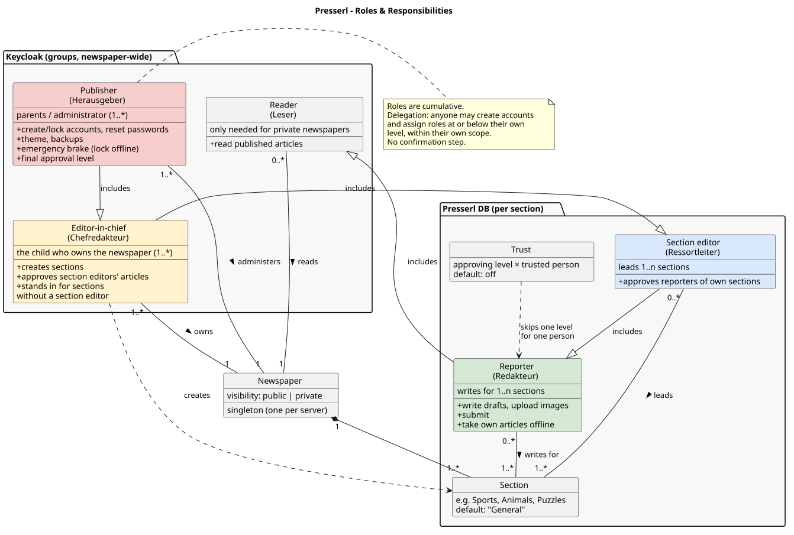
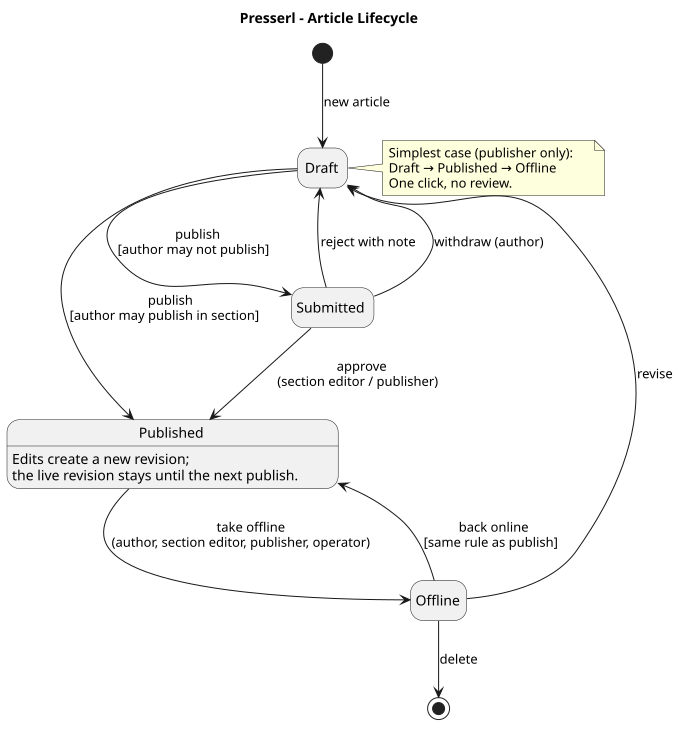
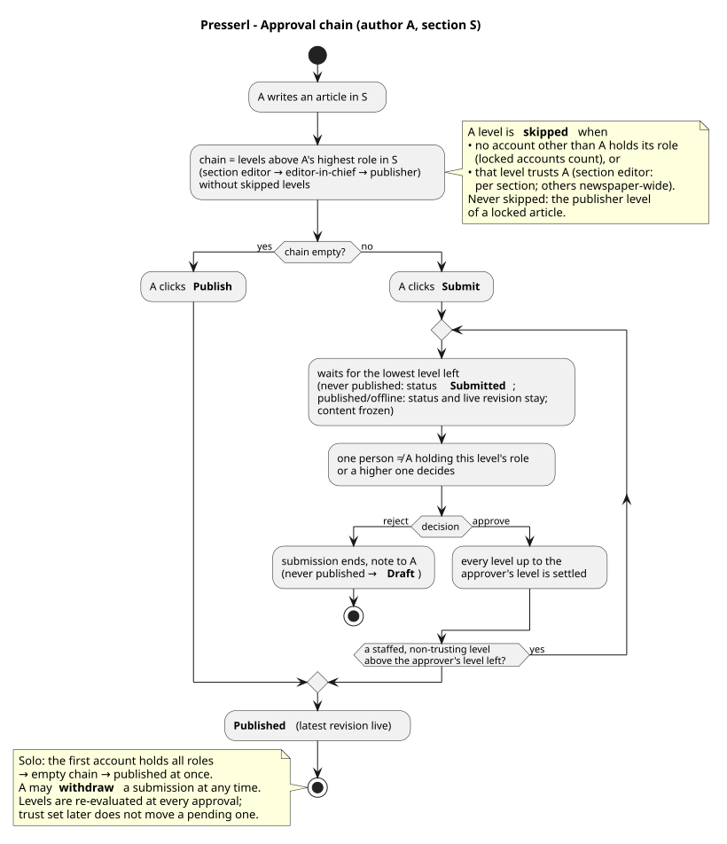

# Roles and editorial workflow

## Roles

Hierarchy: **Publisher > Editor-in-chief > Section editor > Reporter > Reader.** Roles are cumulative — every role includes everything the roles below it may do (an editor-in-chief may write in every section; a section editor writes in their own sections).

| Role | Enum | German UI label | Stored in | Scope | Typically | Adds to the role below |
|---|---|---|---|---|---|---|
| **Publisher** | `PUBLISHER` | Herausgeber | Keycloak group `publisher` | newspaper + technology | parents / administrator | administration (create and lock accounts, reset passwords, theme, newspaper settings, backups), **emergency brake**, final approval level |
| **Editor-in-chief** | `EDITOR_IN_CHIEF` | Chefredakteur | Keycloak group `editor-in-chief` | whole newspaper | the child who owns the newspaper | creates sections, assembles and publishes issues, approves section editors' articles, stands in for sections without a section editor, newspaper settings (e.g. the reader's default text size) |
| **Section editor** | `SECTION_EDITOR` | Ressortleiter | Presserl DB (per section) | 1..n sections | an older sibling / friend | approves the reporters of their sections |
| **Reporter** | `REPORTER` | Redakteur | Presserl DB (per section) | 1..n sections | friends, siblings | writes, submits, takes own articles offline |
| **Reader** | `READER` | Leser | Keycloak group `reader` | newspaper | family, friends | reads a private newspaper |

- **Several people per role.** Two publishers (both parents), two editors-in-chief, several section editors per section are all fine.
- **Several roles per person.** A person can hold roles on several levels; for an article, the highest role the author holds *in the article's section* counts.
- **Delegation.** Everyone from section editor up may create accounts and assign roles **at or below their own level, within their own scope** — a section editor assigns section editors and reporters only in their own sections and no newspaper-wide roles. Reporters and readers do not delegate. There is no confirmation step; publishers see every account and can lock it — except other publishers and their own.
- **Reporter without a section** ("Redakteur (ohne Ressort)", `sectionlessReporter`): a newspaper-wide marker for someone who only takes photos — they upload and edit their own images in the **Images** view but write no articles, and the admin app opens with the images. It is stored in the Presserl database (acts at once, no Keycloak change) and counts as a role. Editors-in-chief and publishers assign and remove it. An account that loses its last section role (removed from its last section, the section deleted, or roles edited without the marker) and holds neither publisher nor editor-in-chief gets it automatically, so a child who drops out of every section can keep taking photos; an editor-in-chief can clear it again.
- **Implementation split.** Newspaper-wide roles (`PUBLISHER`, `EDITOR_IN_CHIEF`, `READER`) are Keycloak groups and end up in the token. Per-section roles (`SECTION_EDITOR`, `REPORTER`), the sectionless-reporter marker and trust switches live in the Presserl database. The backend manages Keycloak users and groups through a service account, so nobody needs the Keycloak admin console.

## Accounts

- **No e-mail anywhere.** Username = first name (lowercase, ASCII-folded; collisions get a suffix: `anna`, `anna-2`; editable).
- **Default password** = four words from a kid-friendly German word list, joined by dashes (`tiger-wolke-apfel-leiter`). Users may change it.
- **Hand-over** on a printable slip: newspaper name, web address, username, password and a QR code with address and credentials. Scanned with the presserl Android app, it connects to the newspaper and logs in without any typing, and the app stays logged in until logout; scanned with the phone camera, it opens the login in the browser with the username filled in.
- **Password reset** by anyone above the person (delegation rule): publishers reset every account except publishers, editors-in-chief every account holding neither publisher nor editor-in-chief, section editors only reporters who belong to their own sections only. Nobody resets their own password here (users change it in the Keycloak account console); a publisher who is locked out needs the Keycloak admin console. The reset hands out a new pass-phrase on the same slip. No self-registration, no "forgot password".
- **Changing roles** of an existing account follows the password-reset rule (anyone above the person, never oneself, never a publisher) in one form for newspaper-wide and section roles together, all or nothing. Every role that is added or removed must be one the changer may assign; roles left unchanged need none, so a section editor can promote their reporter who also reads the newspaper. At least one role remains. No session is ended: section roles apply at once, newspaper-wide roles with the person's next token refresh (a few minutes).
- **Locking** by publishers only, never of a publisher or of their own account. A locked account cannot log in; unlocking restores it with its password.
- **Setup**: on first start the backend creates the first account as publisher from `PRESSERL_PUBLISHER_USERNAME` / `PRESSERL_PUBLISHER_PASSWORD`. That account holds all roles. The publisher logs in and creates an editor-in-chief.

## Images

Every writer (publisher, editor-in-chief or any section role) and every reporter without a section sees every image of the newspaper in the admin app's **Images** view: who uploaded it when and which articles use it (live, in the current working version or only in older versions). An image can be **cropped** and areas of it **pixelated** (faces, name tags, number plates). The edit replaces the image under the same id in every article at once and cannot be undone.

- **Publishers and editors-in-chief** may edit every image, also one that is live.
- **The uploader** may edit their own image only while no article shows it live and no article waiting for approval uses it — otherwise the change would pass the approval chain. Everyone else may not edit it.
- Two people editing the same image: the second save is refused and the app offers to reload the image; nothing is overwritten silently.

## Article lifecycle

States: `DRAFT → (SUBMITTED →) PUBLISHED ⇄ OFFLINE`. Every pending submission carries the approval level the article currently waits for (*pending level*). `SUBMITTED` is the status of a never-published article that waits; a `PUBLISHED` or `OFFLINE` article keeps its status (and the reader keeps its live revision) while changes, or its way back online, wait. *Locked* in the diagram is `OFFLINE` with the emergency-brake lock set.

## Approval chain

Levels, bottom to top: **section editor (of the article's section) → editor-in-chief → publisher.** The chain of an article is worked out for each of its **contributors** — everyone who wrote one of its revisions that are not live yet (usually just the author *A*; a corrector joins, see *Corrections* below) — and the levels of all contributors together form the chain. For one contributor *A* in section *S*:

1. Start at the level directly above *A*'s highest role in *S*.
2. A level is **skipped** when
   - no account other than *A* holds that level's role — e.g. *S* has no section editor (the editor-in-chief level takes over), or *A* is the only editor-in-chief; locked accounts count as holders, or
   - that level **trusts** *A* — for the section-editor level in *S*, for the editor-in-chief and publisher levels newspaper-wide.

   The publisher level of an article **locked** by the emergency brake is never skipped (see below).
3. Each remaining level needs the approval of **one** person (other than *A*) holding that level's role **or a higher one**. An approval settles every level up to the approver's own: after a section editor the article waits for the next remaining level above (editor-in-chief or publisher), after an editor-in-chief for the publisher, and a publisher's approval publishes at once. Which levels remain is decided again at every submission and approval, so role and trust changes act at once — a pending submission, however, is not moved: an article already waiting for a level that starts to trust *A* keeps waiting for it (approve, reject or withdraw and submit again).
4. When no level remains, the article is **published**: its latest revision becomes live.

While a submission is pending, the article's content and section are **frozen**; the revision under review is always the latest one. **Rejection** needs a note and ends the submission: a never-published article returns to *Draft*, a published or offline article keeps its status and live revision. The author may **withdraw** the submission at any time (no note, no record). Approvals and rejections are recorded with level, revision, reviewer and note; the author sees them in the editor.

**Trust** is a per-person switch, default **off**. A holder of an approving level sets it on a specific person below (trust the 16-year-old, keep checking the 7-year-old). Trust set by one holder applies to the whole level.

- A user sets trust only for their **own highest level**: a publisher for the publisher level, an editor-in-chief (not publisher) for the editor-in-chief level, a section editor (neither) for the section-editor level — **per section**, in each of their sections. Trust in *Sports* skips the section-editor level only for the person's articles in *Sports*.
- Only on a person **below** that level who writes there: the publisher on editors-in-chief and section members, an editor-in-chief on section members (not editors-in-chief), a section editor on the reporters of their section. Never on oneself.
- **Any holder** of the level may clear a trust, whoever set it. Changing someone's roles does not remove their trust; stale entries stay visible in the account list and can be cleared. Deleting a section removes its trust entries.
- Setting trust does not move pending submissions (see step 3).
- *Limitation:* an editor-in-chief who is also the only section editor of a section cannot trust for the section-editor level there (own highest level only), so reporters there always wait for that level. Their editor-in-chief approval settles it anyway, and their editor-in-chief trust skips the next level.

**Corrections by higher levels.** Instead of rejecting with a note, a higher level may correct an article itself: a section editor of the article's section, an editor-in-chief or a publisher, when their level lies above the author's. This works while the article waits for approval (if their level reaches the level it waits for) and on published or offline articles — never on drafts, which stay the author's. Rules:

- A correction always starts a new revision under the corrector's name; the byline stays the author's. The author sees "last changed by …" and can open the changes word by word.
- A correction is **not an approval**: the corrector approves afterwards, and the corrector's own levels join the chain — trust in the author does not skip them. A corrector may submit or publish their own correction of a published article.
- A correction keeps the article's section. Correctors never delete or withdraw.
- Two people saving at once: the second save (or an approval of a version that was changed meanwhile) is refused and the app offers to reload.
- Publishers can switch corrections off for the newspaper (see *Overrides*).

Consequences:

- The first account holds all roles → it publishes immediately.
- Parents as publishers check every article until they trust the child.
- A section editor's article goes editor-in-chief → publisher.
- The UI never shows *Submit* or a review queue when no level applies.

## Growth stages — a family example

| Stage | Newsroom | Flow |
|---|---|---|
| **1 — Solo** (default after installation) | one person with the bootstrap account (all roles) | *Write → Publish → Take offline.* No approval; no *Submit* button, no review queue. |
| **2 — Parents supervise** | parents = publishers, child = editor-in-chief | The child writes; one parent approves. Once the parents trust the child, it publishes directly. |
| **3 — Second chief / section editor** | + an older sibling as second editor-in-chief or as section editor for *Sports* | The sibling's articles: section editor → editor-in-chief (the child) → publisher (parents), minus trusted levels. |
| **4 — Reporters** | + friends as reporters in some sections | Reporter → section editor of the section (or editor-in-chief if the section has none) → publisher, each level skipped once it trusts the reporter. |

## Taking offline and the emergency brake

- **Taking offline never needs approval** — author (own articles), section editors of the section, editors-in-chief, publishers. Withdrawing is the safe direction.
- **Emergency brake:** an article taken offline by a publisher is **locked**; only a publisher can put it back online. While it is locked, the publisher level belongs to its chain — staffed, trusted or not — so lower approvals only move it up to the publisher. The lock ends when the article goes online, or when a publisher **unlocks** it; the article then stays offline and the ordinary chain applies again.
- **Back online** otherwise follows the approval chain. A submission pending when the article is taken offline stays pending; approving it puts the article back online with its latest revision.
- **Editing a published article** creates a new revision; the live revision stays until the new one passes the chain.
- **The server decides.** Responses carry `allowedActions`; clients only render what the server lists and never re-implement the chain.

## Issues

Issues are assembled by **editors-in-chief and publishers** (`MANAGE_ISSUES`); section editors and reporters do not see them in the admin app. Publishing an issue needs no approval — the articles inside went through their own chain.

- **Blog mode:** one issue that is switched live from the start and simply grows; no publication date, maybe never a second issue.
- **Planned issues:** the newest issue (highest number) is not live yet and collects every newly published article; once it is complete it gets a publication date, is switched live, and the next issue is created.
- A newly published article lands in the newest issue on its **first** publication only; editors-in-chief and publishers reorder, move or remove articles in the issues screen (the first one is the lead story). Republishing never moves an article.
- **Readers see an article when it is published and its issue is live.** A published article of a planned issue waits (the admin app shows "waits for issue N") and appears on the front page, its article page, print view and images once the issue is switched live; taking an issue back hides its articles again without changing their status. In blog mode the one issue is live, so a new article is online at once. A published article that belongs to no issue (issue deleted, removed from it) is not shown ("in no issue") until an editor-in-chief puts it into an issue.
- Only issues that are not live can be deleted; their articles then belong to no issue.
- **Front page order:** editors-in-chief and publishers give an article a **front-page weight** (1–999) in the editor. Weighted articles lead the front page, lowest weight first — weight 1 is the lead story, 2–4 the stories below it; all others follow newest first. The weight is not content: no revision, no approval, any status; it stays when the article goes offline and only counts while readers see the article. Section editors and reporters do not set it.

## Overrides

| Key | Default | Alternatives | Effect |
|---|---|---|---|
| `presserl.retract.author-can-retract` | `true` | `false` | whether reporters may take their own articles offline |
| `presserl.article.corrections` (`PRESSERL_ARTICLE_CORRECTIONS`) | `true` | `false` | whether higher levels may correct the articles of those below them; per newspaper by publishers only (admin app, *Newspaper*) |

Can be set per deployment and per newspaper (see [architecture.md](architecture.md#configuration)). Approval itself is not configured by keys but by roles and trust.
